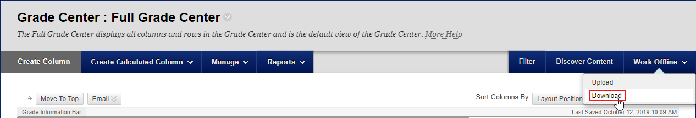
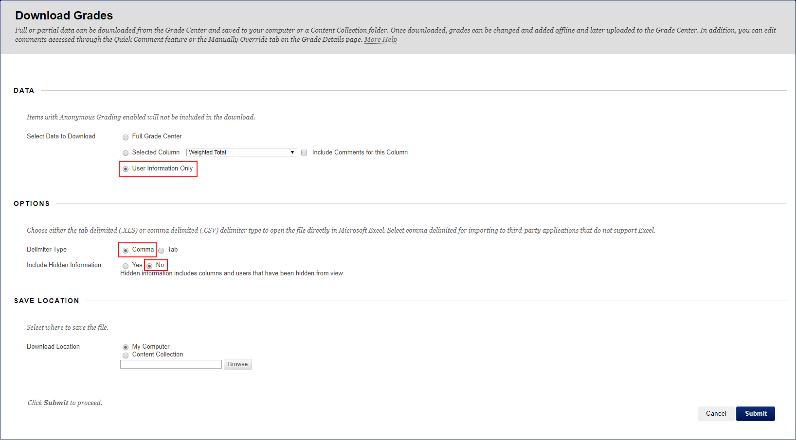

# Blackboard Assignment Organizer
Extracts all submissions for an assignment and isolates individual submissions into clearly named folders.

# Usage
### First Time setup:
For each group of students you intend to use the script with, you must download the class's information as a .csv file.


---


After doing this, the script will be able to use this file to map student IDs to student names.

### Marking an Assignment:

Use Blackboard to download a zip file containing all the submissions for a given assignment and extract the top-level zip file to its own directory. Run the script as follows:
```
Blackboard_Assignment_Organizer.py ./ClassA/Students.csv ./ClassA/Assignment1 ./ClassA/Assignment1_Extracted
```